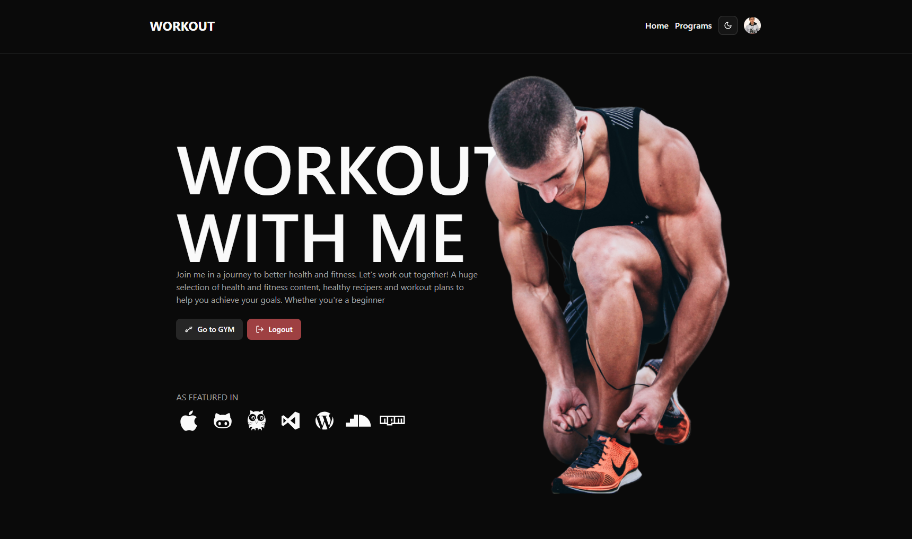
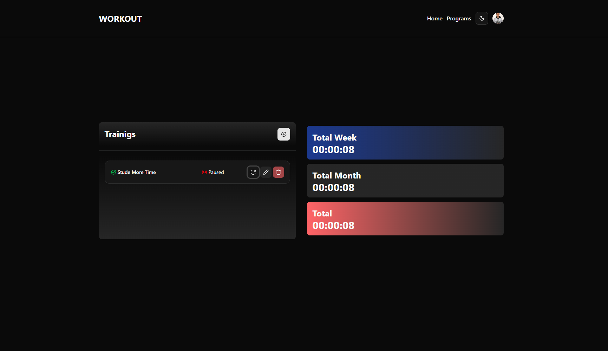

# 🏋️‍♂️ Gym Progress Tracker

This is a learning project to track daily gym tasks, total time spent, and weekly/monthly summaries using Firebase and React ecosystem.

## 🔥 Preview



## 🚀 Live Demo

👉 [Live on Vercel](https://abucoders-gym-progress.vercel.app)

## ⚙️ Features

- 🔐 Firebase Authentication (Email, Google, GitHub, Anonymous)
- 📋 Task tracking (total time, week/month summaries)
- 🔄 React Query for async state management
- 🧪 Form validation with Zod + React Hook Form
- 🎨 UI with Shadcn UI + TailwindCSS
- 🌙 Dark mode (via `next-themes`)
- 💾 Firestore data persistence
- 🔥 Responsive and modern design

## 🛠 Tech Stack

- React + TypeScript
- Vite
- Firebase (Auth, Firestore)
- React Hook Form
- React Query
- Zustand
- Shadcn UI
- TailwindCSS
- Zod
- date-fns



## 👤 Authors

- [@abucoders](https://github.com/abucoders)
- [@abdulloyev](https://github.com/abdulloyev)

## 🧑‍💻 Getting Started

Clone the project

```bash
  git clone https://github.com/abucoders/gym-progress.git
```

Go to the project directory

```bash
  cd gym-progress
```

Install dependencies

```bash
  npm install
```

Start the server

```bash
  npm run dev
```